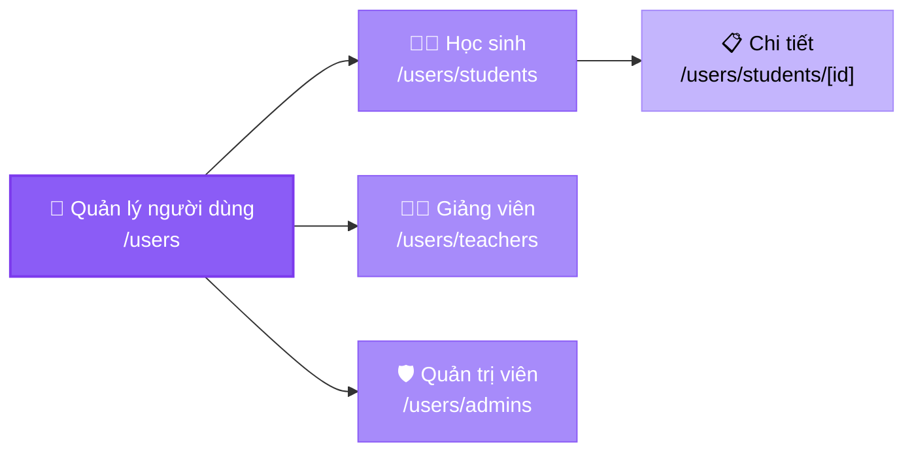
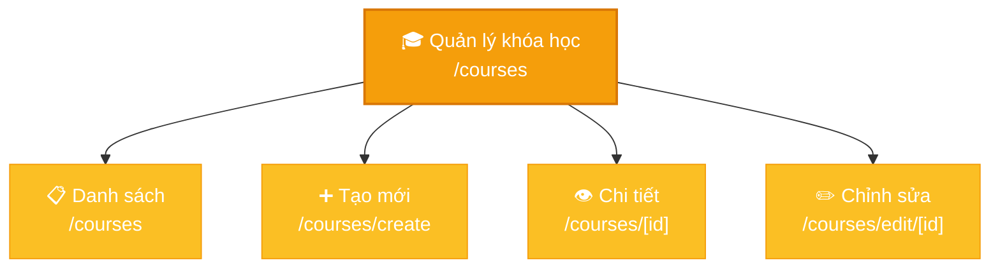
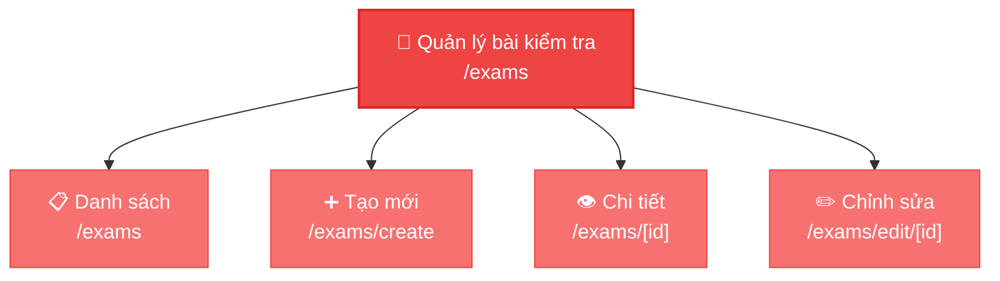
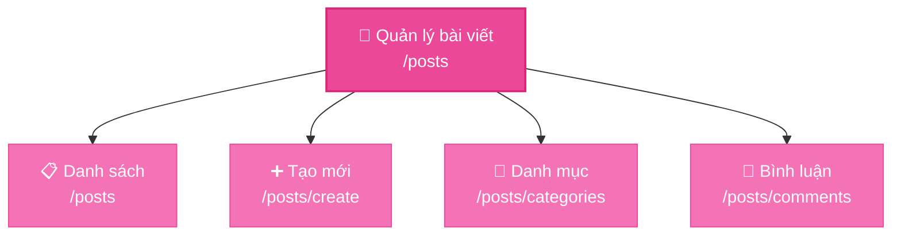
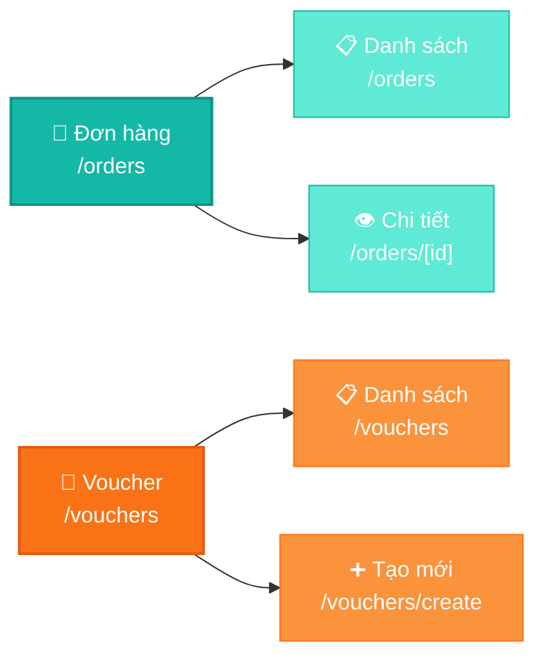
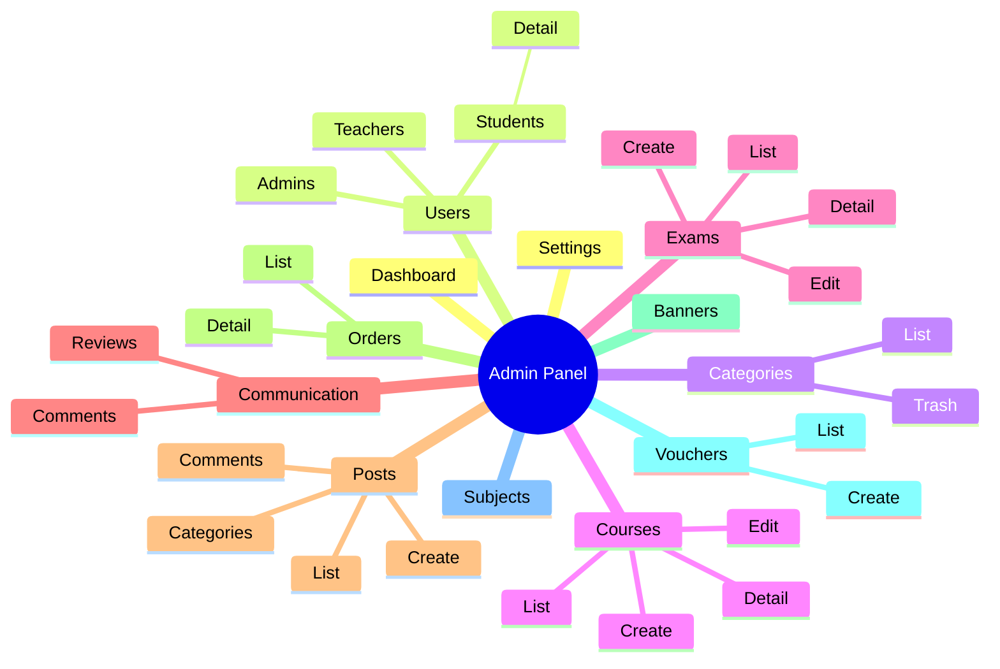

# Sitemap Diagram - Trang Admin Wishzy

> 💡 **Lưu ý**: File này chứa các Mermaid diagrams có thể tự động render trong:
> - VS Code (với extension Mermaid Preview)
> - GitHub/GitLab (tự động render)
> - Các markdown viewer hỗ trợ Mermaid
> - Online tại [mermaid.live](https://mermaid.live)

## Sơ đồ cây phân cấp

```
/[locale]/admin
│
├─ 📊 Dashboard
│  └─ / (Trang chủ admin)
│
├─ 👥 Quản lý người dùng
│  ├─ /users/students (Danh sách học sinh)
│  │  └─ /users/students/[id] (Chi tiết)
│  ├─ /users/teachers (Danh sách giảng viên)
│  └─ /users/admins (Danh sách quản trị viên)
│
├─ 📚 Quản lý danh mục
│  ├─ /categories (Danh sách)
│  └─ /categories/trash → redirect to /categories?deleted=true
│
├─ 🎓 Quản lý khóa học
│  ├─ /courses (Danh sách)
│  ├─ /courses/create (Tạo mới)
│  ├─ /courses/[id] (Chi tiết)
│  └─ /courses/edit/[id] (Chỉnh sửa)
│
├─ 📝 Quản lý bài kiểm tra
│  ├─ /exams (Danh sách)
│  ├─ /exams/create (Tạo mới)
│  ├─ /exams/[id] (Chi tiết)
│  └─ /exams/edit/[id] (Chỉnh sửa)
│
├─ 💬 Quản lý giao tiếp
│  ├─ /communication/reviews (Đánh giá)
│  └─ /communication/comments (Bình luận)
│
├─ 📄 Quản lý bài viết
│  ├─ /posts (Danh sách)
│  ├─ /posts/create (Tạo mới)
│  ├─ /posts/categories (Danh mục)
│  └─ /posts/comments (Bình luận)
│
├─ 🛒 Quản lý đơn hàng
│  ├─ /orders (Danh sách)
│  └─ /orders/[id] (Chi tiết)
│
├─ 🖼️ Quản lý banner
│  └─ /banners
│
├─ 🎫 Quản lý voucher
│  ├─ /vouchers (Danh sách)
│  └─ /vouchers/create (Tạo mới)
│
├─ 📖 Môn học (Không có trong sidebar)
│  └─ /subjects
│
└─ ⚙️ Cài đặt
   └─ /settings
```

## Mermaid Diagrams

### 1. Sơ đồ tổng quan (Overview)

```mermaid
graph TB
    Root["/[locale]/admin<br/>🏠 Admin Panel"] 
    
    Root --> Dashboard["📊 Dashboard<br/>/"]
    Root --> Users["👥 Quản lý người dùng"]
    Root --> Categories["📚 Quản lý danh mục"]
    Root --> Courses["🎓 Quản lý khóa học"]
    Root --> Exams["📝 Quản lý bài kiểm tra"]
    Root --> Communication["💬 Quản lý giao tiếp"]
    Root --> Posts["📄 Quản lý bài viết"]
    Root --> Orders["🛒 Quản lý đơn hàng"]
    Root --> Banners["🖼️ Quản lý banner"]
    Root --> Vouchers["🎫 Quản lý voucher"]
    Root --> Subjects["📖 Môn học"]
    Root --> Settings["⚙️ Cài đặt"]
    
    style Root fill:#3b82f6,stroke:#1e40af,stroke-width:3px,color:#fff
    style Dashboard fill:#10b981,stroke:#059669,color:#fff
    style Users fill:#8b5cf6,stroke:#7c3aed,color:#fff
    style Courses fill:#f59e0b,stroke:#d97706,color:#fff
    style Exams fill:#ef4444,stroke:#dc2626,color:#fff
    style Communication fill:#06b6d4,stroke:#0891b2,color:#fff
    style Posts fill:#ec4899,stroke:#db2777,color:#fff
    style Orders fill:#14b8a6,stroke:#0d9488,color:#fff
    style Banners fill:#6366f1,stroke:#4f46e5,color:#fff
    style Vouchers fill:#f97316,stroke:#ea580c,color:#fff
    style Settings fill:#64748b,stroke:#475569,color:#fff
```



### 2. Sơ đồ chi tiết - Quản lý người dùng



### 3. Sơ đồ chi tiết - Quản lý khóa học



### 4. Sơ đồ chi tiết - Quản lý bài kiểm tra



### 5. Sơ đồ chi tiết - Quản lý bài viết



### 6. Sơ đồ chi tiết - Quản lý đơn hàng & Voucher



### 7. Sơ đồ đầy đủ (Full Sitemap)

```mermaid
graph TB
    Admin["/[locale]/admin"] 
    
    Admin --> Dashboard["📊 Dashboard<br/>/"]
    
    Admin --> Users["👥 Users"]
    Users --> U1["👨‍🎓 students"]
    Users --> U2["👨‍🏫 teachers"]
    Users --> U3["🛡️ admins"]
    U1 --> U1a["students/[id]"]
    
    Admin --> Categories["📚 Categories"]
    Categories --> C1["categories"]
    Categories --> C2["categories/trash"]
    
    Admin --> Courses["🎓 Courses"]
    Courses --> Co1["courses"]
    Courses --> Co2["courses/create"]
    Courses --> Co3["courses/[id]"]
    Courses --> Co4["courses/edit/[id]"]
    
    Admin --> Exams["📝 Exams"]
    Exams --> E1["exams"]
    Exams --> E2["exams/create"]
    Exams --> E3["exams/[id]"]
    Exams --> E4["exams/edit/[id]"]
    
    Admin --> Comm["💬 Communication"]
    Comm --> Comm1["communication/reviews"]
    Comm --> Comm2["communication/comments"]
    
    Admin --> Posts["📄 Posts"]
    Posts --> P1["posts"]
    Posts --> P2["posts/create"]
    Posts --> P3["posts/categories"]
    Posts --> P4["posts/comments"]
    
    Admin --> Orders["🛒 Orders"]
    Orders --> O1["orders"]
    Orders --> O2["orders/[id]"]
    
    Admin --> Banners["🖼️ Banners"]
    Banners --> B1["banners"]
    
    Admin --> Vouchers["🎫 Vouchers"]
    Vouchers --> V1["vouchers"]
    Vouchers --> V2["vouchers/create"]
    
    Admin --> Subjects["📖 Subjects"]
    Subjects --> S1["subjects"]
    
    Admin --> Settings["⚙️ Settings"]
    Settings --> Set1["settings"]
    
    style Admin fill:#3b82f6,stroke:#1e40af,stroke-width:3px,color:#fff
    style Dashboard fill:#10b981,stroke:#059669,color:#fff
    style Users fill:#8b5cf6,stroke:#7c3aed,color:#fff
    style Courses fill:#f59e0b,stroke:#d97706,color:#fff
    style Exams fill:#ef4444,stroke:#dc2626,color:#fff
    style Comm fill:#06b6d4,stroke:#0891b2,color:#fff
    style Posts fill:#ec4899,stroke:#db2777,color:#fff
    style Orders fill:#14b8a6,stroke:#0d9488,color:#fff
    style Banners fill:#6366f1,stroke:#4f46e5,color:#fff
    style Vouchers fill:#f97316,stroke:#ea580c,color:#fff
    style Settings fill:#64748b,stroke:#475569,color:#fff
```



### 8. Mindmap Style



## Thống kê

- **Tổng số routes chính**: 12 modules
- **Tổng số pages**: 29+ pages
- **Routes có sub-pages**:
  - Users: 4 routes (3 list + 1 detail)
  - Courses: 4 routes (list, create, detail, edit)
  - Exams: 4 routes (list, create, detail, edit)
  - Posts: 4 routes (list, create, categories, comments)
  - Orders: 2 routes (list, detail)
  - Vouchers: 2 routes (list, create)
  - Categories: 2 routes (list, trash)
  - Communication: 2 routes (reviews, comments)
  - Students: 2 routes (list, detail)

## Phân loại theo chức năng

### CRUD Operations (Create, Read, Update, Delete)
- ✅ **Courses**: Full CRUD
- ✅ **Exams**: Full CRUD
- ✅ **Vouchers**: Create + Read
- ✅ **Posts**: Create + Read
- ✅ **Orders**: Read only (có detail)
- ✅ **Users**: Read only (có detail cho students)

### Management Pages (Chỉ xem/quản lý)
- 📋 **Categories**: List + Trash
- 📋 **Banners**: List
- 📋 **Subjects**: List
- 📋 **Settings**: Configuration

### Communication Pages
- 💬 **Reviews**: Quản lý đánh giá
- 💬 **Comments**: Quản lý bình luận (2 nơi: communication và posts)

## Routes không có trong Sidebar

- `/subjects` - Môn học (có page nhưng không có trong menu)

