# Sitemap Diagram - Trang Client Wishzy

> 💡 **Lưu ý**: File này chứa các Mermaid diagrams có thể tự động render trong:
> - VS Code (với extension Mermaid Preview)
> - GitHub/GitLab (tự động render)
> - Các markdown viewer hỗ trợ Mermaid
> - Online tại [mermaid.live](https://mermaid.live)

## Sơ đồ cây phân cấp

```
/[locale]/
│
├─ 🏠 Trang chủ
│  └─ / (Homepage)
│
├─ 📄 Giới thiệu
│  └─ /about
│
├─ 🔐 Xác thực
│  ├─ /auth/login
│  ├─ /auth/register
│  ├─ /auth/forgot-password
│  ├─ /auth/reset-password
│  └─ /auth/verify-email
│
├─ 🎓 Khóa học
│  ├─ /course-detail/[id]
│  └─ /search
│
├─ 📚 Học tập
│  ├─ /learning/[courseId]
│  └─ /learning/[courseId]/[lectureId]
│
├─ 📝 Quiz
│  ├─ /quiz
│  ├─ /quiz/[quizId]
│  └─ /quiz/[quizId]/result
│
├─ 📰 Blog
│  ├─ /blog
│  └─ /blog/[blogId]
│
├─ 🛒 Giỏ hàng & Thanh toán
│  ├─ /cart
│  ├─ /checkout
│  ├─ /checkout/success
│  ├─ /payment/callback
│  └─ /payment-result
│
├─ 👤 Người dùng
│  ├─ /profile
│  ├─ /dashboard
│  └─ /certificates/[enrollmentId]
│
└─ 👨‍🏫 Giảng viên
   ├─ /instructor
   ├─ /instructor/revenue
   ├─ /instructor/courses
   ├─ /instructor/courses/create
   ├─ /instructor/courses/[id]
   ├─ /instructor/courses/edit/[id]
   ├─ /instructor/courses/sales
   ├─ /instructor/course/[id]
   ├─ /instructor/user/students
   └─ /instructor/comments
```

## Mermaid Diagrams

### 1. Sơ đồ tổng quan (Overview)

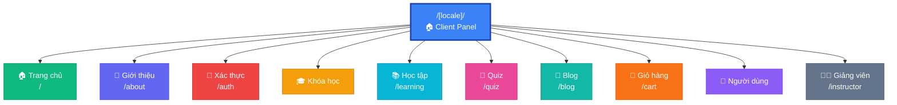

### 2. Sơ đồ chi tiết - Xác thực (Authentication)

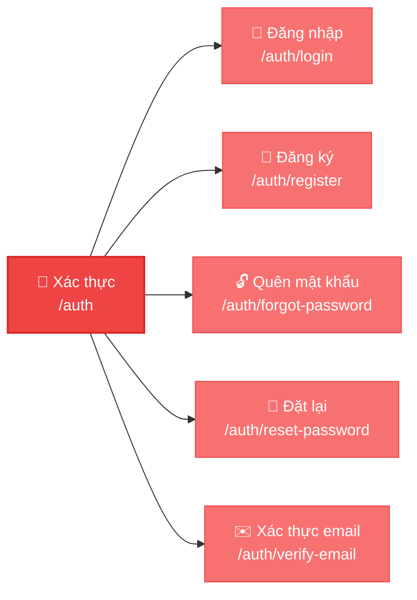

### 3. Sơ đồ chi tiết - Khóa học & Học tập

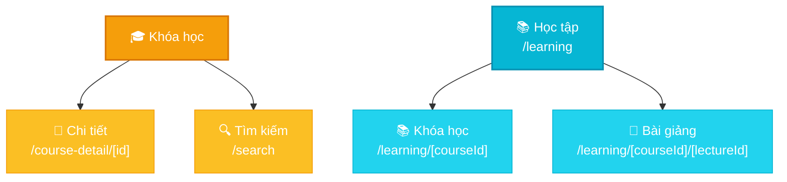

### 4. Sơ đồ chi tiết - Quiz

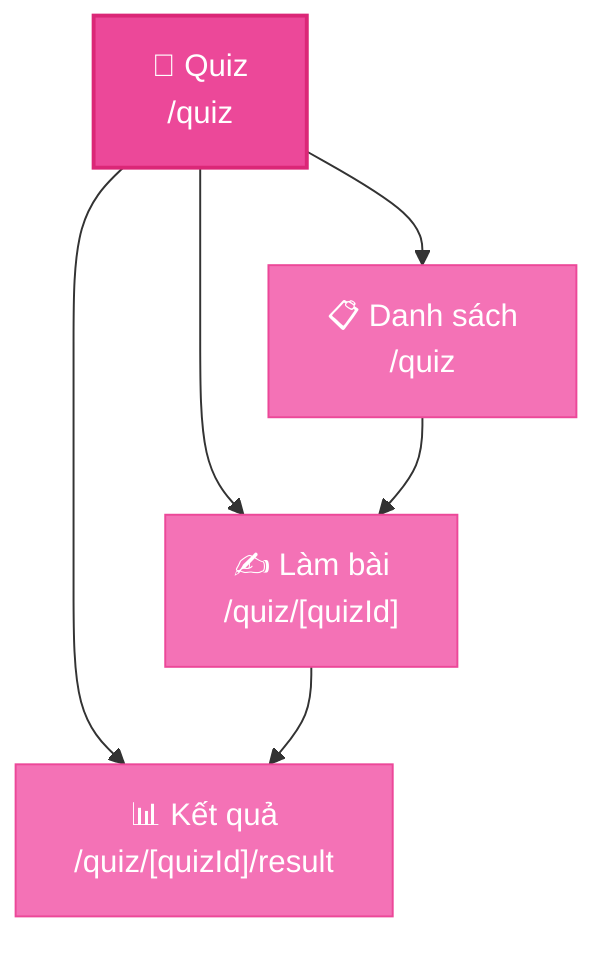

### 5. Sơ đồ chi tiết - Giỏ hàng & Thanh toán

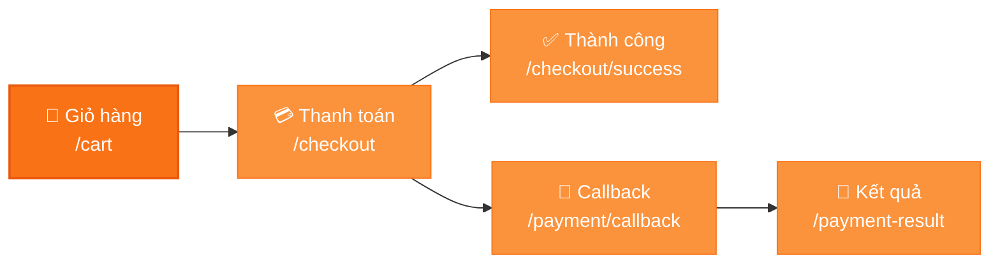

### 6. Sơ đồ chi tiết - Người dùng

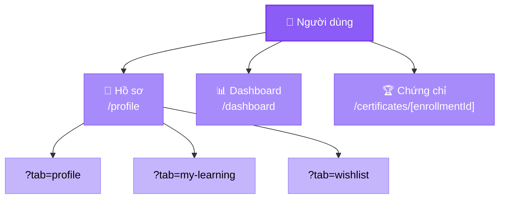

### 7. Sơ đồ chi tiết - Giảng viên (Instructor)

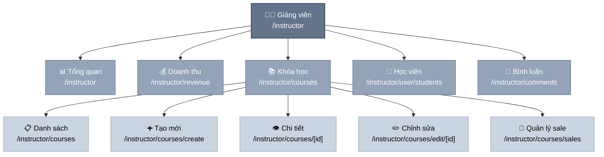

### 8. Sơ đồ đầy đủ (Full Sitemap)

```mermaid
graph TB
    Client["/[locale]/"] 
    
    Client --> Home["🏠 /"]
    Client --> About["📄 /about"]
    
    Client --> Auth["🔐 /auth"]
    Auth --> A1["login"]
    Auth --> A2["register"]
    Auth --> A3["forgot-password"]
    Auth --> A4["reset-password"]
    Auth --> A5["verify-email"]
    
    Client --> CourseDetail["🎓 /course-detail/[id]"]
    Client --> Search["🔍 /search"]
    
    Client --> Learning["📚 /learning"]
    Learning --> L1["[courseId]"]
    Learning --> L2["[courseId]/[lectureId]"]
    
    Client --> Quiz["📝 /quiz"]
    Quiz --> Q1["/"]
    Quiz --> Q2["[quizId]"]
    Quiz --> Q3["[quizId]/result"]
    
    Client --> Blog["📰 /blog"]
    Blog --> B1["/"]
    Blog --> B2["[blogId]"]
    
    Client --> Cart["🛒 /cart"]
    Client --> Checkout["💳 /checkout"]
    Client --> CheckoutSuccess["✅ /checkout/success"]
    Client --> PaymentCallback["🔄 /payment/callback"]
    Client --> PaymentResult["📄 /payment-result"]
    
    Client --> Profile["👤 /profile"]
    Client --> UserDashboard["📊 /dashboard"]
    Client --> Certificates["🏆 /certificates/[enrollmentId]"]
    
    Client --> Instructor["👨‍🏫 /instructor"]
    Instructor --> I1["/"]
    Instructor --> I2["revenue"]
    Instructor --> I3["courses"]
    Instructor --> I4["courses/create"]
    Instructor --> I5["courses/[id]"]
    Instructor --> I6["courses/edit/[id]"]
    Instructor --> I7["courses/sales"]
    Instructor --> I8["user/students"]
    Instructor --> I9["comments"]
    
    style Client fill:#3b82f6,stroke:#1e40af,stroke-width:3px,color:#fff
    style Home fill:#10b981,stroke:#059669,color:#fff
    style Auth fill:#ef4444,stroke:#dc2626,color:#fff
    style Learning fill:#06b6d4,stroke:#0891b2,color:#fff
    style Quiz fill:#ec4899,stroke:#db2777,color:#fff
    style Cart fill:#f97316,stroke:#ea580c,color:#fff
    style Profile fill:#8b5cf6,stroke:#7c3aed,color:#fff
    style Instructor fill:#64748b,stroke:#475569,color:#fff
```

### 9. Mindmap Style

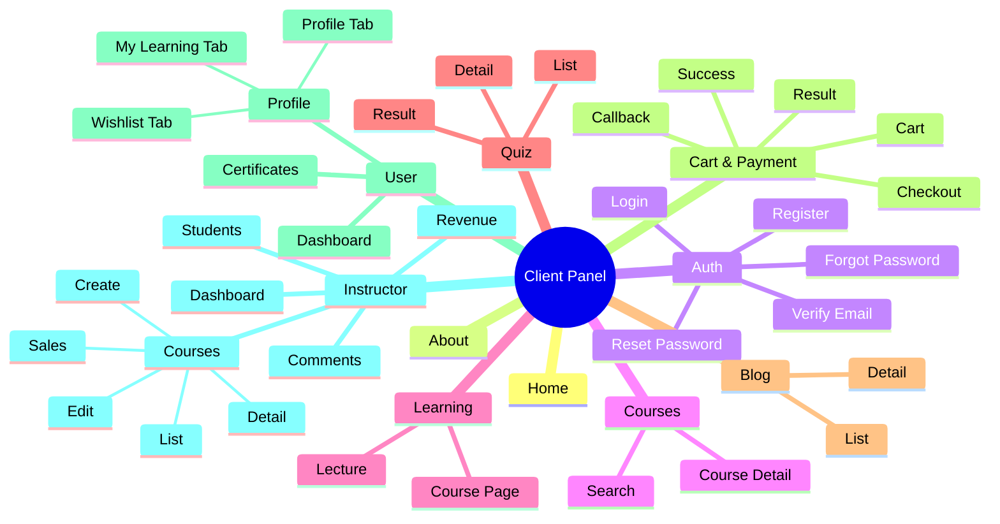

### 10. User Flow - Mua khóa học

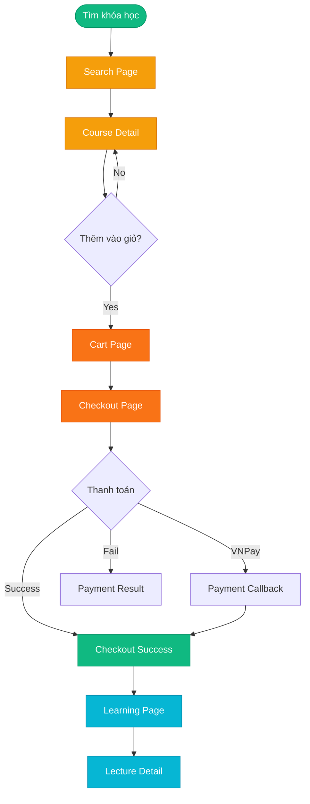

### 11. User Flow - Làm Quiz

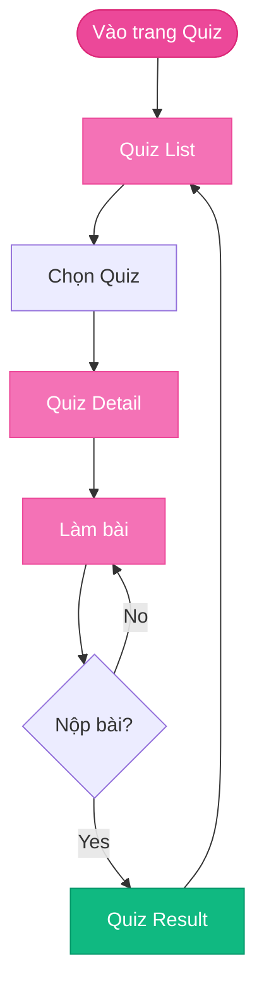

## Thống kê

- **Tổng số routes chính**: 10 modules
- **Tổng số pages**: 40+ pages
- **Public routes**: ~15 routes (không cần đăng nhập)
- **Protected routes**: ~10 routes (cần đăng nhập)
- **Instructor routes**: ~10 routes (chỉ giảng viên)
- **Auth routes**: 5 routes

## Phân loại theo quyền truy cập

### Public (Không cần đăng nhập)
- 🟢 **Home** - Trang chủ
- 🟢 **About** - Giới thiệu
- 🟢 **Auth** - Tất cả trang xác thực
- 🟢 **Course Detail** - Chi tiết khóa học
- 🟢 **Search** - Tìm kiếm
- 🟢 **Blog** - Danh sách và chi tiết
- 🟢 **Quiz List** - Danh sách quiz

### Protected (Cần đăng nhập)
- 🔒 **Learning** - Học khóa học
- 🔒 **Quiz Detail/Result** - Làm quiz
- 🔒 **Cart** - Giỏ hàng
- 🔒 **Checkout** - Thanh toán
- 🔒 **Profile** - Hồ sơ
- 🔒 **Dashboard** - Bảng điều khiển
- 🔒 **Certificates** - Chứng chỉ

### Instructor Only (Chỉ giảng viên)
- 👨‍🏫 **Instructor Dashboard** - Tất cả routes `/instructor/*`
- 👨‍🏫 **Course Management** - Quản lý khóa học
- 👨‍🏫 **Revenue** - Quản lý doanh thu
- 👨‍🏫 **Students** - Quản lý học viên
- 👨‍🏫 **Comments** - Quản lý bình luận

## Routes đặc biệt

- **Profile tabs**: Sử dụng query params `?tab=profile|my-learning|wishlist`
- **Payment callback**: Xử lý callback từ VNPay gateway
- **Learning routes**: Dynamic routes với `[courseId]` và `[lectureId]`
- **Instructor course routes**: Có 2 routes cho chi tiết (`/courses/[id]` và `/course/[id]`)

